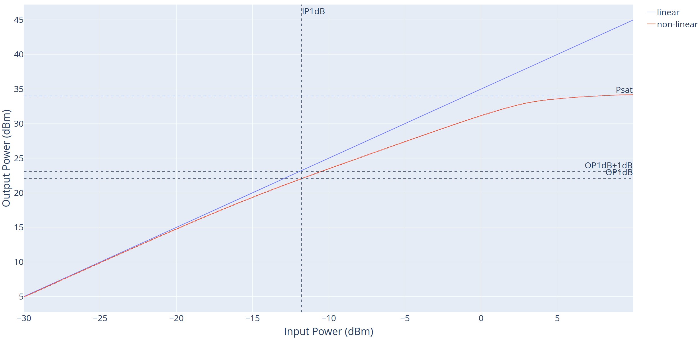
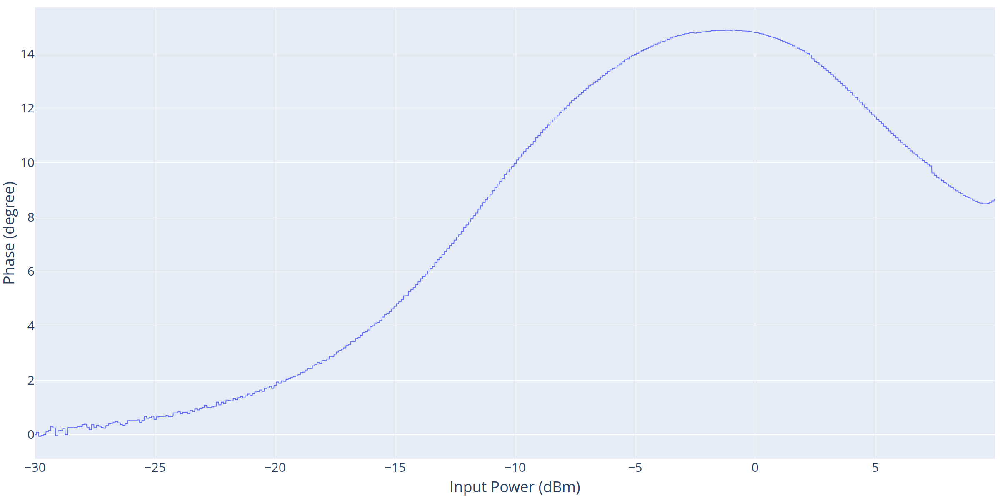
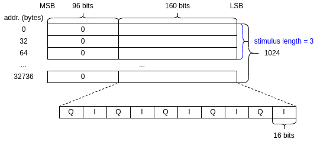

# Calibration Procedure Development
## How to Run
* Test power amplifier non-linear model
    * `python3 test_pow_amp_non_lin.py`
* Test non-linear effect
    * `python3 test_non_lin_effect_simulator.py`
## LUT Non-Linear Model

# Test Data Generation of Hardware
## How to Run
* Generate test data to verify digital IP and firmware control on FPGA
    * `cd gen_test_data`
    * `python3 gen_test_data.py`
## Memory Data Format
