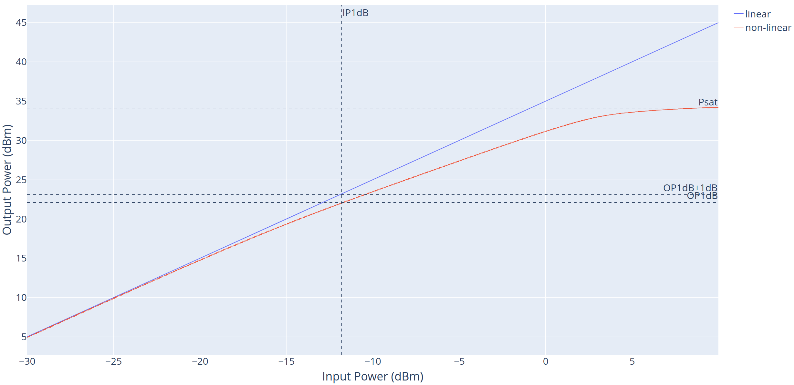
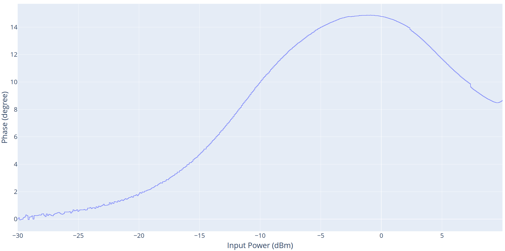

# Folder Structure

```
equalizer-coef-gen/
├── gen_rx_filter/              # Rx filter design and coefficient generation
│   ├── gen_aaf_coef.py         #   AAF (anti-aliasing filter) coefficient generator
│   ├── gen_rx_filter.py        #   Main script: designs and evaluates the full Rx filter chain
│   ├── joint_opt_aaf_eqz.py    #   Joint optimization of AAF and equalizer
│   ├── aaf_freq_resp/          #   AAF frequency response and impulse response data (JSON/NPY)
│   ├── update_aaf_freq_resp/   #   Input data used to update the AAF frequency response table
│   └── figure/                 #   Output: Rx filter analysis figures (HTML)
│       └── aaf_resp/           #     AAF frequency response overlay figures
├── gen_test_data/              # Test data generation for FPGA hardware verification
│   ├── gen_test_data.py        #   Main script: generates stimulus and expected-output binary files
│   └── tx_equalizer/           #   Test vectors specific to the Tx equalizer block
│       ├── settings/           #     FIR filter settings (JSON)
│       └── waveform/           #     Waveform simulation data (JSON)
├── model/                      # Input models (LUT AM-AM/AM-PM, chirp/OFDM signal definitions)
├── training_sig/               # Training signal files used for equalizer coefficient solving
├── util/                       # Shared utilities (JSON I/O, signal analysis, plotting helpers)
├── chisel3cr/                  # Fixed-point arithmetic helpers matching the Chisel3 hardware types
├── diagram/                    # Top-level figures (memory data format diagram, PA model plots)
├── tx_equalizer_design.py      # Tx equalizer design and coefficient generation
├── gen_equalizer_coef.py       # Entry point: generates final equalizer coefficients
├── anal_coef_fine_tune.py      # Fine-tuning analysis of generated coefficients
├── non_lin_effect_simulator.py # PA non-linearity effect simulator
├── pow_amp_non_lin_*.py        # Power amplifier non-linear models (LUT, Rapp, Saleh)
└── plot_result.py              # Result plotting script
```

# Test Data Generation of Hardware
## How to Run
* Generate test data to verify digital IP and firmware control on FPGA
    * `cd gen_test_data`
    * `python3 gen_test_data.py`
## Memory Data Format


# Generation of Equalizer Coefficient
## How to Run
* `python3 gen_equalizer_coef.py`

# Generation of Rx Filter
See [gen_rx_filter/README.md](gen_rx_filter/README.md) for design details and result figures.
## How to Run
```bash
python3 ./gen_rx_filter/gen_rx_filter.py
```

# Calibration Procedure Development
## How to Run
* Test power amplifier non-linear model
    * `python3 test_pow_amp_non_lin.py`
* Test non-linear effect
    * `python3 test_non_lin_effect_simulator.py`
## LUT Non-Linear Model



