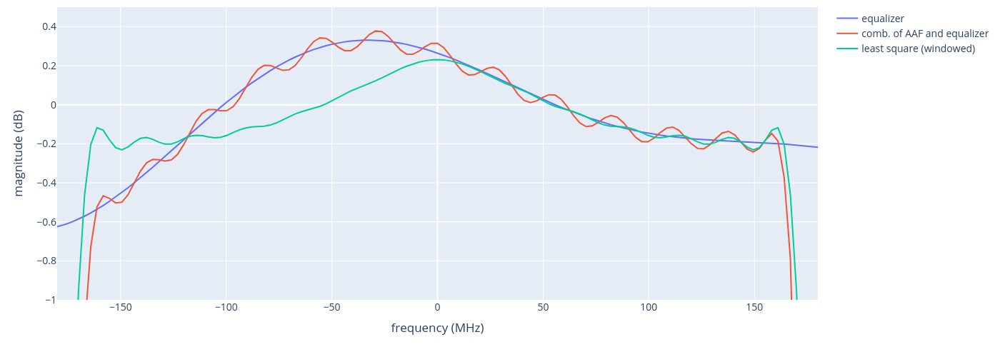
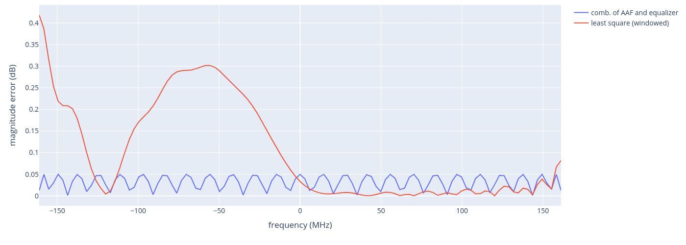

# Rx Filter Design (`gen_aaf_coef.py`)

## Overview

The Rx filter chain consists of two cascaded filters:

1. **AAF (Anti-Aliasing Filter)** — equiripple lowpass FIR designed via the Remez exchange algorithm (`FilterDesign`). Attenuates out-of-band energy before decimation. Passband edge and stopband edge are configured per sample-rate mode.

2. **Equalizer (EQZ) approximation** — least-squares FIR designed via `firls` (`FirlsFilterDesign`). Approximates the target EQZ frequency response (magnitude only) using a windowed least-squares fit, with an explicit stopband weight to suppress out-of-band leakage.

## Filter Design Classes

| Class | Algorithm | Phase | Input |
|---|---|---|---|
| `FilterDesign` | Remez (equiripple) | Linear | passband/stopband edges, ripple/attenuation specs |
| `FirlsFilterDesign` | Weighted least-squares (`firls`) | Linear | complex frequency response (magnitude taken) |

## Compared Responses

Three responses are evaluated and plotted:

- **equalizer** — raw target EQZ response (ideal reference)
- **comb. of AAF and equalizer** — cascade of the Remez AAF with the raw EQZ target
- **least square (windowed)** — `FirlsFilterDesign` fit to the EQZ magnitude with Hamming window

## Results

### Magnitude Response


### In-Band Magnitude Error (relative to EQZ target)


## How to Run

```bash
python3 gen_rx_filter/gen_aaf_coef.py
```

Output figures are saved to `gen_rx_filter/figure/aaf_resp/`.
